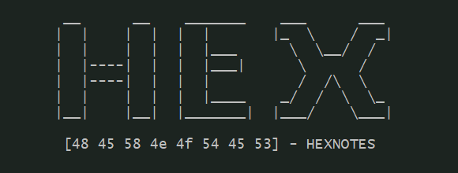

<h1> HexNotes Buggy x86 Binaries </h1>

    </img>

Hello There, HexNotes was a open repository of some x86 binary project list. I've Created These Binaries for Self Learn x86 architecture and x86 Reverse Engineering on windows platforms. These all binaries written in Gnu C Programming Language & Compiled on Windows using Mingw (Minimalist GNU for Windows).

**WARNING: These All Binaries are buggy applications. Use it on your own risk!**

<h3><code><i>HexNotes Binaries: </i></code></h3>
    
    1. KeyCheck
    
            KeyCheck.exe is a Beginer Level Reverse Challenge. Your Goal is Find Out the Password and solve the Chiper Challenge.
            
    2. Project bOS
            
            The Basic Open-source OS Kernel project.
